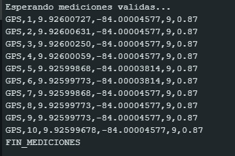
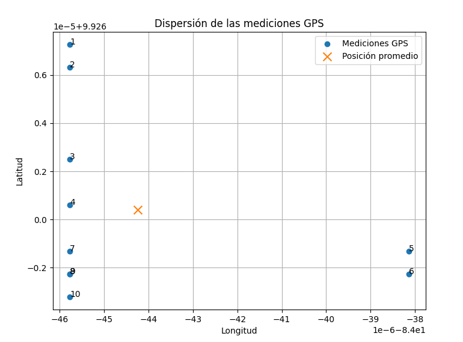
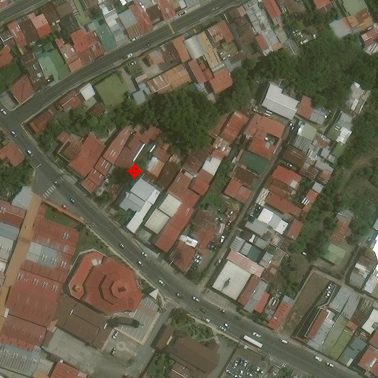

# Sistema de estimación de parámetros geométricos de una vía

## Descripción

Este proyecto corresponde al desarrollo de un sistema automatizado para la estimación de parámetros físicos y geométricos de una vía, principalmente su **ancho**, utilizando  **geolocalización GPS, imágenes satelitales como método principal y procesamiento de imágenes capturadas mediante una cámara**.

El sistema busca complementar soluciones existentes de medición de velocidad vehicular basadas en modelos de detección como **YOLO**, proporcionando información sobre el entorno físico de la vía que permita mejorar la calibración y precisión de dichas estimaciones.

## La propuesta utiliza una arquitectura en la que la adquisición de datos puede realizarse mediante hardware embebido, mientras que el procesamiento y análisis de la información puede realizarse posteriormente en un sistema externo.

# Arquitectura general

Actualmente, el desarrollo se divide en varias etapas:

```text
┌──────────────────────┐
│      NEO-6M GPS     │
└──────────┬───────────┘
           │
           │ Datos NMEA
           ▼
┌──────────────────────┐
│       Arduino        │
│                      │
│ Validación de datos  │
│ GPS + satélites      │
│ + HDOP                │
└──────────┬───────────┘
           │
           │ 10 mediciones válidas
           ▼
┌──────────────────────┐
│        Python        │
│                      │
│ Análisis estadístico │
│ Promedio             │
│ Dispersión           │
│ Desviación           │
└──────────┬───────────┘
           │
           │ Latitud/Longitud promedio
           ▼
┌──────────────────────┐
│ Imágenes satelitales │
│      Esri World      │
│       Imagery        │
└──────────┬───────────┘
           │
           ▼
┌──────────────────────┐
│ Mosaico de teselas   │
│        3 × 3         │
│                      │
│ + posición GPS       │
└──────────┬───────────┘
           │
           ▼
┌──────────────────────┐
│ Análisis geométrico  │
│       de la vía      │
└──────────────────────┘
```

La arquitectura final incorporará además una cámara para utilizar información visual de la escena vial, de acuerdo con los objetivos establecidos para el proyecto.

---

# Etapa 1 — Adquisición de datos GPS

## Hardware

Para la adquisición de las coordenadas se utiliza un módulo **NEO-6M GPS**, conectado a un Arduino UNO mediante comunicación serial.

La conexión utilizada actualmente es:

| Componente   |        Arduino |
| ------------ | -------------: |
| NEO-6M TX    |          Pin 4 |
| NEO-6M RX    |          Pin 3 |
| Baud rate    |           9600 |
| Comunicación | SoftwareSerial |

El Arduino se encarga de recibir continuamente las sentencias NMEA generadas por el módulo GPS y procesarlas mediante la biblioteca `TinyGPS++`.

### Bibliotecas utilizadas

```cpp
#include <SoftwareSerial.h>
#include <TinyGPS++.h>
```

---

# Validación de las mediciones GPS

No todas las mediciones proporcionadas por el GPS se consideran confiables para el sistema.

Antes de almacenar una medición, el programa verifica que estén disponibles:

* Coordenadas GPS válidas.
* Número de satélites válido.
* Valor de HDOP válido.

Posteriormente se aplican criterios mínimos de calidad:

```text
Satélites ≥ 4
HDOP ≤ 2.0
```

Además, las mediciones válidas deben estar separadas por un intervalo mínimo de:

```text
2 segundos
```

Esto evita tomar múltiples muestras prácticamente simultáneas y permite obtener una serie de mediciones distribuidas temporalmente.

---

# Obtención de las 10 mediciones

El sistema establece como objetivo:

```cpp
const int MEDICIONES_OBJETIVO = 10;
```

Por lo tanto, el Arduino continúa recibiendo y evaluando datos hasta obtener **10 mediciones que cumplan todos los criterios de validación**.

Cada medición se transmite por el puerto serial utilizando el siguiente formato:

```text
GPS,indice,latitud,longitud,satelites,HDOP
```

Por ejemplo:



Cada registro contiene:

| Campo       | Descripción                       |
| ----------- | --------------------------------- |
| `GPS`       | Identificador del tipo de dato    |
| `indice`    | Número de medición                |
| `latitud`   | Latitud registrada                |
| `longitud`  | Longitud registrada               |
| `satelites` | Satélites utilizados/recibidos    |
| `HDOP`      | Indicador de precisión geométrica |

Cuando se obtienen las 10 mediciones, Arduino transmite:

```text
FIN_MEDICIONES
```

y detiene la adquisición.

---

# Etapa 2 — Procesamiento de los datos en Python

Una vez obtenidas las mediciones GPS, los datos son procesados mediante **Python**.

El objetivo de esta etapa es determinar una posición representativa de la ubicación donde se realizó la captura.

En lugar de utilizar directamente una única medición, se utilizan las 10 mediciones obtenidas para calcular diferentes parámetros estadísticos.

Entre los parámetros considerados se encuentran:

* Latitud promedio.
* Longitud promedio.
* Valor mínimo de latitud.
* Valor máximo de latitud.
* Valor mínimo de longitud.
* Valor máximo de longitud.
* Dispersión de las coordenadas.
* Desviación de las mediciones.
* Número de satélites.
* Valores de HDOP.

El uso de múltiples mediciones permite analizar qué tan concentradas se encuentran las posiciones obtenidas por el GPS.

---

# Coordenada promedio

A partir de las mediciones válidas se calcula una coordenada representativa:

```text
Latitud promedio
Longitud promedio
```

Actualmente, para las pruebas de obtención de imágenes satelitales se utiliza como ejemplo:

```python
LATITUD = 9.92600040
LONGITUD = -84.00004424
```

Esta coordenada representa el punto que posteriormente se utiliza como referencia para obtener la imagen satelital correspondiente.



---

# Etapa 3 — Obtención de imágenes satelitales

Una vez determinada la coordenada promedio, Python utiliza la latitud y longitud para localizar la zona correspondiente dentro de un sistema de teselas (*tiles*).

La fuente utilizada actualmente es:

```text
Esri World Imagery
```

mediante el servicio:

```text
ArcGIS World_Imagery
```

---

# ¿Qué es una tesela?

Una imagen satelital de una región grande no necesariamente se descarga como una única imagen.

Los servicios de mapas dividen el planeta en pequeñas imágenes cuadradas llamadas **teselas** (*tiles*).

Cada tesela tiene actualmente:

```text
256 × 256 píxeles
```

y se identifica mediante tres parámetros:

```text
X → posición horizontal
Y → posición vertical
Z → nivel de zoom
```

Por ejemplo:

```text
Zoom = 19
X = ...
Y = ...
```

El nivel de zoom determina el nivel de detalle de las imágenes.

A mayor `ZOOM`, mayor nivel de detalle y menor área geográfica cubierta por cada tesela.

---

# Conversión de coordenadas GPS a teselas

Para obtener las teselas correspondientes a una coordenada geográfica, primero se transforma:

```text
Latitud / Longitud
        ↓
Coordenadas de píxel global
        ↓
Coordenadas de tesela
```

La transformación utiliza la proyección Web Mercator.

La función:

```python
latlon_a_pixel()
```

convierte la latitud y longitud a coordenadas de píxel globales.

Posteriormente:

```python
latlon_a_tile()
```

determina la tesela en la que se encuentra la coordenada.

---

# Generación del mosaico satelital

Una única tesela puede no proporcionar suficiente contexto alrededor de la posición GPS.

Por esta razón, actualmente se descargan **9 teselas**, formando un mosaico:

```text
┌────────┬────────┬────────┐
│ Tile   │ Tile   │ Tile   │
│  X-1,Y-1 │ X,Y-1 │ X+1,Y-1 │
├────────┼────────┼────────┤
│ Tile   │ Tile   │ Tile   │
│ X-1,Y   │ X,Y   │ X+1,Y   │
├────────┼────────┼────────┤
│ Tile   │ Tile   │ Tile   │
│ X-1,Y+1 │ X,Y+1 │ X+1,Y+1 │
└────────┴────────┴────────┘
```

Esto corresponde a un mosaico:

```text
3 × 3 teselas
```

Como cada tesela tiene:

```text
256 × 256 píxeles
```

el resultado es una imagen de:

```text
768 × 768 píxeles
```

---

# Ubicación de la coordenada GPS dentro de la imagen

Una de las partes importantes del proceso es que no solamente se obtiene la imagen satelital.

También se determina **exactamente en qué píxel del mosaico se encuentra la coordenada GPS promedio**.

El procedimiento es:

```text
Latitud/Longitud promedio
          ↓
Píxel global
          ↓
Origen del mosaico
          ↓
Píxel relativo dentro del mosaico
```

El código calcula:

```python
pixel_x_global
pixel_y_global
```

y posteriormente determina:

```python
pixel_x
pixel_y
```

que representan la posición de la coordenada dentro de la imagen final.

---

# Marcador de posición

Para facilitar la visualización y comprobación del resultado, se dibuja un marcador sobre la imagen satelital.

El marcador está compuesto por:

* Un círculo.
* Una cruz.
* Coordenadas correspondientes a la posición promedio del GPS.

De esta manera se puede verificar visualmente que la ubicación calculada corresponde a la zona donde se realizaron las mediciones.

---

# Resultado actual

El resultado de esta etapa es una imagen:




que contiene:

1. El mosaico de imágenes satelitales.
2. La zona correspondiente a la coordenada GPS.
3. La posición promedio de las mediciones GPS marcada sobre la imagen.

El resultado permite comprobar que el sistema puede pasar desde mediciones obtenidas físicamente mediante el GPS hasta una representación geográfica de la ubicación sobre una imagen satelital.

---

# Tecnologías utilizadas 

## Hardware

* Arduino UNO
* Módulo GPS NEO-6M
* Posteriormente: Raspberry Pi 4 (De ser posible)
* Posteriormente: cámara compatible CSI o USB

## Software

### Arduino UNO

* C/C++
* Arduino IDE
* `SoftwareSerial`
* `TinyGPS++`

### Python

* Python 3
* `requests`
* `Pillow`
* `Matplotlib`
* `math`

### Datos geoespaciales

* Coordenadas GPS
* Latitud
* Longitud
* HDOP
* Número de satélites
* Web Mercator
* Teselas (*tiles*)
* Imágenes satelitales
* Esri World Imagery
* ArcGIS REST API

Consultar el [tutorial de múltiples capas](https://developers.arcgis.com/openlayers/maps/raster-tile-basemaps/display-multiple-basemap-layers/) para ver la documentación oficial de Esri.

---

# Flujo actual del sistema

El flujo implementado hasta este punto puede resumirse de la siguiente manera:

```text
             NEO-6M
                │
                ▼
        ┌───────────────┐
        │    Arduino    │
        └───────┬───────┘
                │
                ▼
       Datos GPS / NMEA
                │
                ▼
       Validación de datos
                │
        ┌───────┴────────┐
        │                │
   Satélites ≥ 4     HDOP ≤ 2.0
        │                │
        └───────┬────────┘
                │
                ▼
      10 mediciones válidas
                │
                ▼
             Python
                │
                ▼
       Análisis estadístico
                │
                ▼
       Latitud promedio
       Longitud promedio
                │
                ▼
      Conversión Lat/Lon
       → píxel global
                │
                ▼
       Conversión a Tile
                │
                ▼
          3 × 3 Tiles
                │
                ▼
       Mosaico 768 × 768
                │
                ▼
      Ubicación GPS marcada
                │
                ▼
       Imagen satelital
```

---
